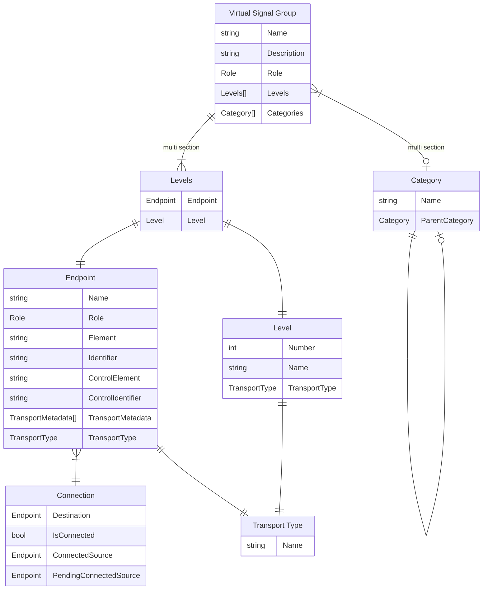

# Data Model

```mermaid
erDiagram
    "Category" {
        string Name
        Category ParentCategory
    }
    "Connection" {
        Endpoint Destination
        bool IsConnected
        Endpoint ConnectedSource
        Endpoint PendingConnectedSource
    }
    "Endpoint" {
        string Name
        Role Role
        string Element
        string Identifier
        string ControlElement
        string ControlIdentifier
        TransportMetadata[] TransportMetadata
        TransportType TransportType
    }
    "Level" {
        int Number
        string Name
        TransportType TransportType
    }
    "Transport Type" {
        string Name
    }
    "Virtual Signal Group" {
        string Name
        string Description
        Role Role
        Levels[] Levels
        Category[] Categories
    }
    "Levels" {
        Endpoint Endpoint
        Level Level
    }

    "Category" ||--o| "Category" : ""
    "Virtual Signal Group" ||--|{ "Levels" : "multi section"
    "Virtual Signal Group" }|--|o "Category" : "multi section"
    "Endpoint" }|--|| "Connection" : ""
    "Endpoint" ||--|| "Transport Type" : ""
    "Levels" ||--|| "Endpoint" : ""
    "Levels" ||--|| "Level" : ""
    "Level" ||--|| "Transport Type" : ""
```
